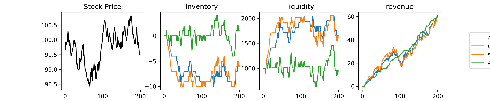

# Avellaneda-Stoikov Market Making Simulator

Python implementation of a market-making simulator inspired by the
Avellaneda-Stoikov framework for optimal bid and ask quoting under inventory
risk.

The project compares simple benchmark agents against an inventory-aware
Avellaneda-Stoikov style agent in a simulated limit order book environment.
It is designed as a compact quantitative finance project with reproducible
experiments, generated result tables, plots, and a PDF report.

## Overview

Market makers quote both bid and ask prices. They earn the spread when orders
are filled, but they also accumulate inventory risk when buy and sell fills are
unbalanced.

The Avellaneda-Stoikov model adjusts quotes dynamically based on inventory,
volatility, time remaining, and risk aversion. The main idea is that a market
maker with positive inventory should quote more aggressively on the ask side
and less aggressively on the bid side, encouraging trades that reduce inventory
exposure.

This project simulates that idea by comparing three trading agents:

- `ConstantSpreadAgent`: quotes a fixed bid and ask spread.
- `SymmetricAgent`: uses the Avellaneda-Stoikov spread without inventory skew.
- `ASModelAgent`: adds an inventory-aware skew to manage position risk.

## Features

- Stochastic mid-price simulation using a Brownian motion model.
- Exponential order-arrival intensity based on quote distance from the mid-price.
- Shared agent interface for comparing different quoting strategies.
- Monte Carlo experiment runner with configurable number of simulations.
- Reproducible experiments through random seeds.
- Generated CSV summary tables.
- Generated example-path plot showing price, inventory, liquidity, and revenue.
- Automated PDF report generation with experiment results and plots.

## Quick Start

Install the project dependencies:

```powershell
pip install -r requirements.txt
```

Run the main Monte Carlo experiment:

```powershell
python run_experiment.py --nsims 1000
```

For a reproducible run, pass a random seed:

```powershell
python run_experiment.py --seed 42 --nsims 1000
```

The reproducible command above generates the same experiment setup used for
`simulation_results_example.pdf`.

The experiment creates:

```text
simulation_results.pdf
data_simulation_results/fair_experiment.csv
data_simulation_results/fair_examplepath.png
```

## Repository Structure

```text
.
+-- src/
|   +-- config.py                # Simulation parameters
|   +-- market_makers.py         # Trading agent definitions
|   +-- simulator.py             # Main simulation loop
|   +-- stochastic_processes.py  # Price and order-arrival processes
+-- run_experiment.py            # Runs Monte Carlo experiment and creates report
+-- data_simulation_results/     # Generated CSV and plot outputs
|   +-- fair_experiment.csv      # Monte Carlo summary table
|   +-- fair_examplepath.png     # Example simulation path plot
+-- simulation_results.pdf       # Generated PDF report
+-- simulation_results_example.pdf # Example report generated with a fixed seed
+-- Archiv/                      # Archived exploratory notebooks
+-- requirements.txt             # Python dependencies
```

## Methodology

### Mid-Price Process

For the fair market setting, the mid-price is simulated as a Brownian motion:

```python
S_t = S_0 + sigma * W_t
```

where:

- `S_0` is the initial mid-price.
- `sigma` controls price volatility.
- `W_t` is a Brownian motion term.

This is implemented in `src/stochastic_processes.py`.

### Fill Intensity

Order-fill intensity decreases exponentially with the distance between the
quoted price and the mid-price:

```python
lambda(delta) = A * exp(-k * delta)
```

where:

- `A` controls the baseline order-arrival intensity.
- `k` controls how quickly fill probability decreases as quotes move away from
  the mid-price.
- `delta` is the bid or ask distance from the mid-price.

This gives the simulator a simple but useful trade-off: quotes placed closer to
the mid-price are more likely to fill, while wider quotes earn more spread when
they do fill.

### Portfolio Value

The simulator tracks cash, inventory, and total portfolio value:

```python
portfolio_value = cash + inventory * mid_price
```

It also computes exponential utility:

```python
utility = -exp(-gamma * pnl)
```

where `gamma` is the risk-aversion parameter.

### Avellaneda-Stoikov Quote Rule

The current inventory-aware agent uses an Avellaneda-Stoikov style spread and
inventory skew:

```python
spread = gamma * sigma**2 * (T - t) + 2 * log(1 + gamma / k) / gamma
skew = inventory * gamma * sigma**2 * (T - t) / T

bid_delta = spread / 2 + skew
ask_delta = spread / 2 - skew
```

When inventory is positive, the agent moves its quotes to encourage selling and
reduce inventory exposure. When inventory is negative, it does the opposite.

## Trading Agents

The simulator is designed around a common agent interface:

```python
class TradingAgent:
    def quote(self, state: MarketState) -> tuple[float, float]:
        """Return bid_delta, ask_delta."""
```

Each agent receives the current market state and returns bid and ask distances
from the mid-price.

### Constant Spread Agent

The constant spread agent is a simple benchmark. It always returns the same bid
and ask deltas, regardless of inventory, volatility, or time remaining.

### Symmetric Agent

The symmetric agent uses the Avellaneda-Stoikov spread formula but does not
adjust for inventory. It is useful as an intermediate benchmark because it uses
the model's spread logic without the inventory-management component.

### AS Inventory Agent

The AS inventory agent uses both the spread and inventory skew. This allows it
to adapt its quotes when the trading strategy accumulates a large long or short
position.

## Example Results

The experiment runner compares agents over repeated simulated market paths. The
summary table reports:

- Mean profit.
- Profit standard deviation.
- Sharpe-style profit ratio.
- Mean liquidity.
- Liquidity standard deviation.

The generated plot shows one example path with:

- Simulated stock price.
- Agent inventory.
- Cash/liquidity.
- Revenue over time.

If the result image is available, it can be viewed here:



The full generated report is saved as:

```text
simulation_results.pdf
```

## Current Limitations

- The limit order book model is simplified and uses synthetic order arrivals.
- The project does not currently use historical market data.
- Transaction costs, latency, queue position, and adverse selection are not yet
  modeled.
- The experiment runner has only a small number of command-line options.
- Automated tests are not yet included.
- The experimental insider-market extension is not part of the main report.

## Future Work

Possible extensions include:

- Add automated tests for the quote logic, simulator output shapes, and
  accounting identities.
- Add command-line options for output paths, market condition, volatility, risk
  aversion, and order-arrival parameters.
- Add inventory-risk metrics such as average absolute inventory, maximum
  inventory, and terminal inventory distribution.
- Add parameter sweeps for volatility, risk aversion, and fill-intensity
  parameters.
- Extend the PDF report with inventory-risk plots and strategy comparisons.
- Compare the qualitative behavior of the simulation against the
  Avellaneda-Stoikov paper.
- Calibrate the model against real or historical limit order book data.

## Reference

Avellaneda, M. and Stoikov, S. (2008). High-frequency trading in a limit order
book. Quantitative Finance, 8(3), 217-224.
